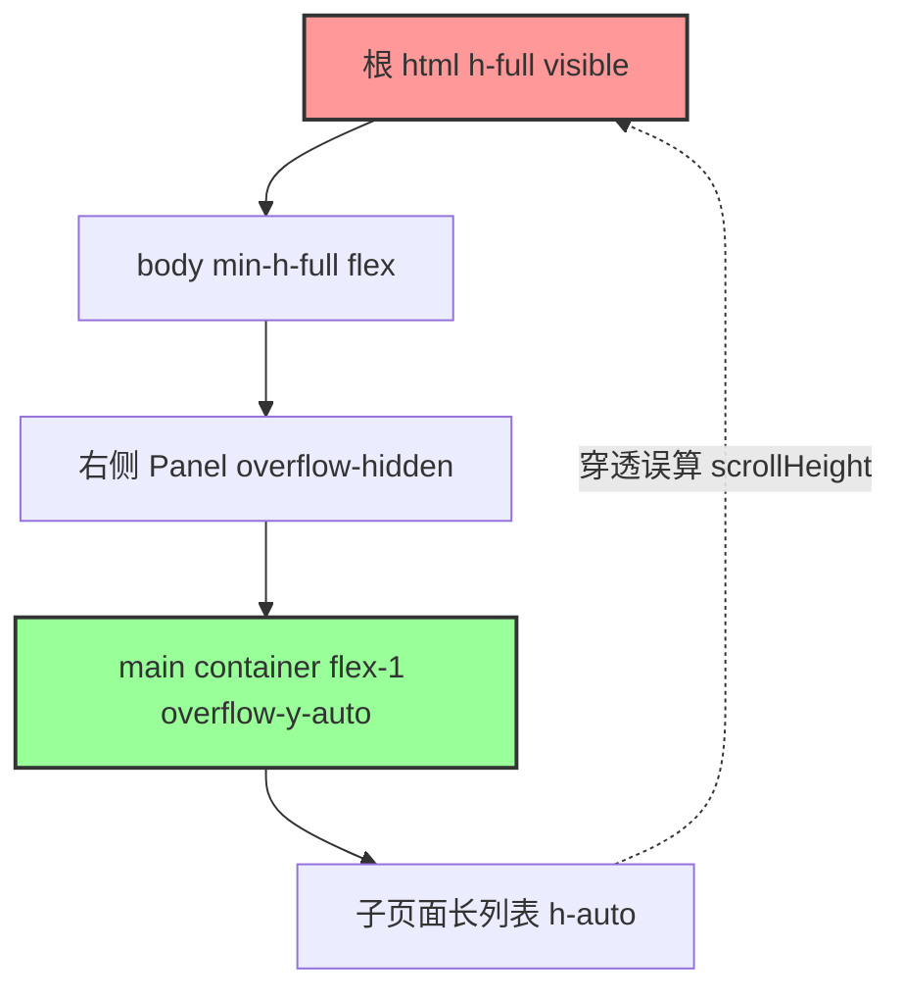

# 大面积神秘留白？记一次因“双滚动条冲突”导致的前端布局排查与完美解决

> 💡 **导读**：你是否也在开发中遇到过这样的诡异现象：页面滚到底部时，居然多出了好几百像素的“神秘空白”？甚至连固定定位的侧边栏、顶部导航都被整体顶出了屏幕？
> 
> 今天，我们就来深度复盘一次在 SaaS 后台管理系统开发中，针对“页面底部大面积留白”这一看似简单、实则暗藏玄机的前端 Bug 排查与解决之旅。从**“跑出问题”**、**“定位元凶”**到**“完美解决”**，带你一窥浏览器高度计算与双滚动条冲突的底层逻辑。

---

## 🚨 第一幕：跑出问题 (The Problem)

在进行中后台系统的项目联调时，测试人员突然发来了一连串的 Bug 截图，涉及多个高频使用的业务数据列表页。

**Bug 表现非常一致**：
当这些页面中加载了 20 条以上的数据（数据表格变长）时，**滚到底部，整个页面下方就会多出大面积的灰色空白**。更要命的是，右侧内容滚动时，原本应该钉在左侧的侧边栏（Sidebar）和顶部的 Header 居然也被整体“推”出了屏幕上方，留下一片虚空。

为了理清原因，我们开启了排查模式。

---

## 🔍 第二幕：寻根溯源 (Investigation)

### 1. 对比排除法：为什么部分页面完好无损？
在排查过程中，我们发现了一个关键性的控制变量：**系统中的另一个静态数据展示页面表现得堪称完美**。
无论表格有多少条数据，该页面在滚动到底部时都干净利落，没有一丁点多余的空白。

对比代码后，我们发现受影响的几个页面，其包裹容器都曾被套上了高度自适应的“万能胶水”：
```tsx
// ❌ 存在 Bug 页面的布局套路
<div className="flex flex-col flex-1 min-h-0 space-y-6">
  <Card className="flex-1 min-h-0">
    <CardContent className="flex-1 min-h-0">
      ...
    </CardContent>
  </Card>
</div>
```
而正常的静态展示页面只用了极简的文档流：
```tsx
//  正常页面的极简布局
<div className="space-y-6">
  <Card>
    <CardContent>
      ...
    </CardContent>
  </Card>
</div>
```

### 2. 认识误区：去掉 `flex-grow` 就能一劳永逸吗？
很多同学看到这里会想：那简单啊，直接去掉子页面里所有的 `flex-1` 和 `min-h-0`，让它回归正常的块级布局流（Block Flow）不就行了？

我们迅速进行了这个尝试，将这些页面重构回自然的文档流布局。然而，**在局部长数据滚动下，底部依然有少量的留白，且依然会偶发顶起侧边栏的怪异行为**。

这说明，`flex-grow` 只是导火索，**最底层的渲染引擎高度计算另有隐情**！

---

## 🤖 第三幕：真相大白 (Root Cause)

为了彻底摸清浏览器在滚动时的重绘轨迹，我们启动了动态监测，追踪了整个应用从 `html` -> `body` -> `main` 这一完整样式继承树的高度计算：



通过这一级一级的动态溯源，导致“神秘留白”的终极元凶浮出水面——**双滚动条计算穿透 Bug**。

1. **局部滚动的理想设计**：
   在后台的主布局 `layout.tsx` 中，滚动条被设计为仅在右侧局部视口 `<main className="flex-1 overflow-y-auto p-6">` 内部触发，这属于典型的现代 SPA（单页应用）局部区域滚动。

2. **全局溢出属性的漏洞**：
   - 根元素 `html` 拥有类名 `h-full`（即高度 100%），但其 `overflow` 属性默认为 `visible`（可见滚动）。
   - `body` 元素被设定为了 `min-h-full`（最小高度 100%，允许无限向下延伸）。
   - 当 `main` 容器内部包含高密度的表格和卡片时，子页面的实际物理高度远超屏幕。

3. **浏览器的灾难性误判**：
   由于 `html/body` 的滚动属性并未硬性锁定，浏览器渲染引擎在计算页面的整体高度时，**误将内部局部滚动的容器展开的高度算作了整个 Window 窗口的 `scrollHeight`**。
   因此，除了局部视口的滚动条外，**最外层的 Window 窗口也被激活了隐藏的整体滚动条**！

4. **为什么侧边栏会被顶上去？**
   当用户在右侧滑动鼠标、触控板，或点击底部元素触发焦点跳转时，浏览器会错误地触发 Window 级别的滚动（将整个视口整体向上偏移了约 600px - 700px）。
   这一偏移直接把整个框架（包括固定高度的左侧侧边栏、顶部 Header）整体推出了屏幕上方，从而在最底部露出了大片的虚无灰色背景。

---

## 🛠️ 第四幕：完美解决 (The Solution)

搞清楚底层逻辑后，药方就变得极其简单且优雅了——**彻底锁死最外层窗口的滚动权，将滚动行为刚性限制在局部视口中。**

### 1. 根布局物理隔离
在主布局文件 `layout.tsx` 中，我们将 `html` 和 `body` 的溢出表现严密锁定：

```diff
     <html
       lang="zh-CN"
-      className={`${geistSans.variable} ${geistMono.variable} h-full antialiased`}
+      className={`${geistSans.variable} ${geistMono.variable} h-full overflow-hidden antialiased`}
       suppressHydrationWarning
     >
-      <body className="min-h-full flex flex-col">
+      <body className="h-full overflow-hidden flex flex-col">
```

### 2. 全局 CSS 底层防御
同时，我们在全局样式表 `globals.css` 的 `@layer base` 中筑起最后一道马奇诺防线，确保没有任何三方组件能再次撑破根视口：

```css
@layer base {
  body {
    @apply bg-background text-foreground h-full overflow-hidden;
  }
  html {
    @apply font-sans h-full overflow-hidden;
  }
}
```

### 3. 子页面结构瘦身
配合根视口的溢出锁定，我们同步将受影响的页面容器中的多余弹性属性剔除，回归干净流畅的 Block Document 渲染模式。

---

## 🌟 第五幕：体验优化与最终疗效

为了让整体后台管理视界更加现代化与极简，我们还顺手完成了一个体验优化——**将侧边栏的默认初始状态更改为“收起”**。

在 `sidebar.tsx` 中：
```diff
 export function Sidebar() {
   const pathname = usePathname();
-  const [collapsed, setCollapsed] = useState(false);
+  const [collapsed, setCollapsed] = useState(true);
```
用户登录或刷新页面后，左侧导航默认以精致的窄边图标呈现，将最黄金的横向视觉焦距完全让给右侧的内容视窗和表格。

### 🩺 最终疗效
修复方案推送至生产环境后：
* 局部滚动表现得精准、顺滑，滚动条**仅**出现在右侧列表区域内。
* 侧边栏和 Header 始终以极高的高级感稳稳固定在屏幕左侧和上方。
* 即使长列表滚动至最底部的分页器，下方与视口边界也完美符合视觉留白规范，大面积空白问题被**彻底完美终结**！
* 生产环境前端构建 **100% 顺利编译通过**，零 Warning 交付！

---

## 💡 总结与金句分享

对于做现代 SPA 或者复杂后台管理系统的开发者来说，有两个金句值得牢记：

> 1. **“Flexbox 不是万能高度胶水”**：不要随意在嵌套多层的普通块级子元素中塞满 `flex-1` 和 `min-h-0`。如果父容器没有刚性且清晰的 Flex 约束，这会导致浏览器布局引擎产生灾难性的重绘开销与高度溢出计算。
> 2. **“SPA 局部滚动，根节点必锁 `hidden`”**：凡是采用了局部滚动面板的后台布局，**必须**在 `html` 和 `body` 元素上严密声明 `overflow: hidden`。只有从根源上斩断 Window 滚动的可能，才能真正实现丝滑、干净的局部滑动体验。

希望这篇实战排查记，能够帮到正在与布局 Bug 斗智斗勇的你！如果你有更好的排查思路或遇到过类似的怪象，欢迎在评论区一起交流探讨！ 🚀
